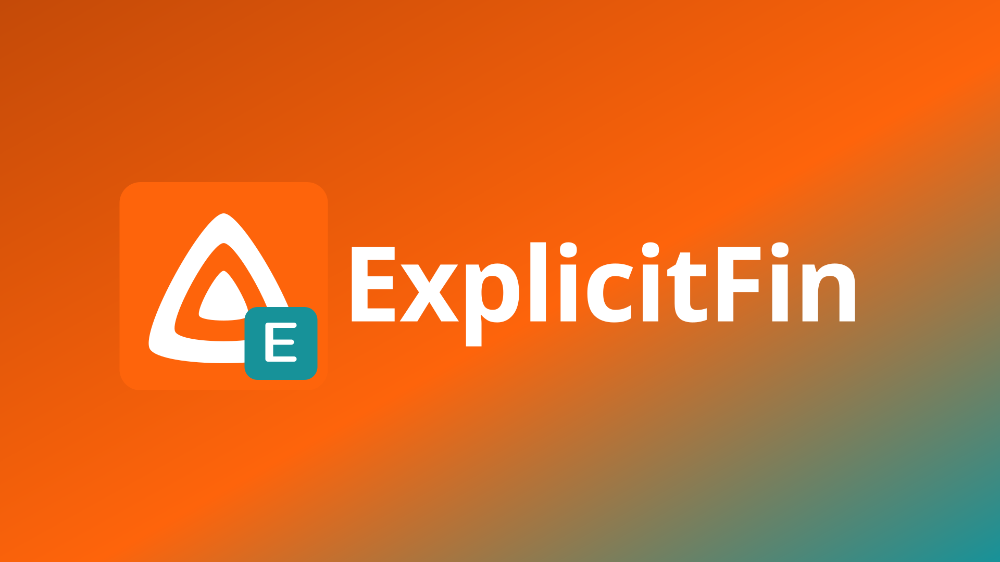
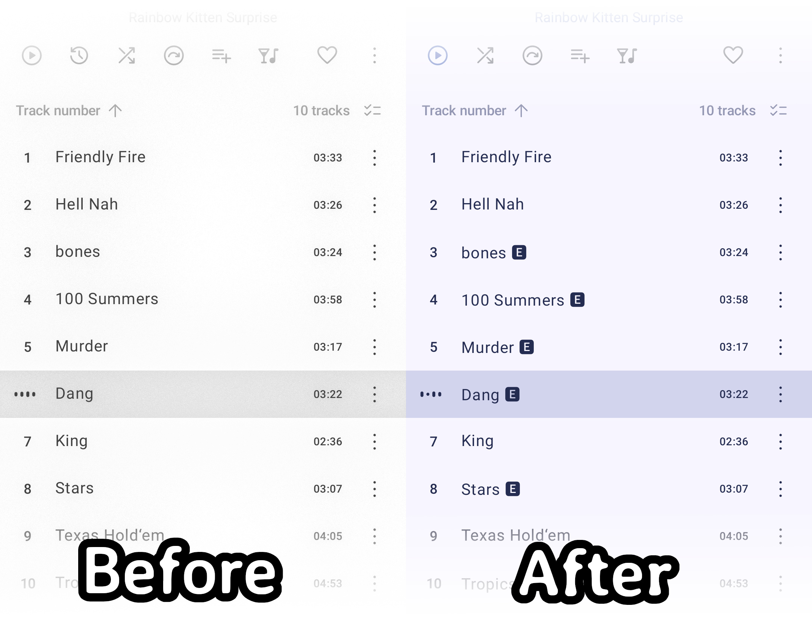
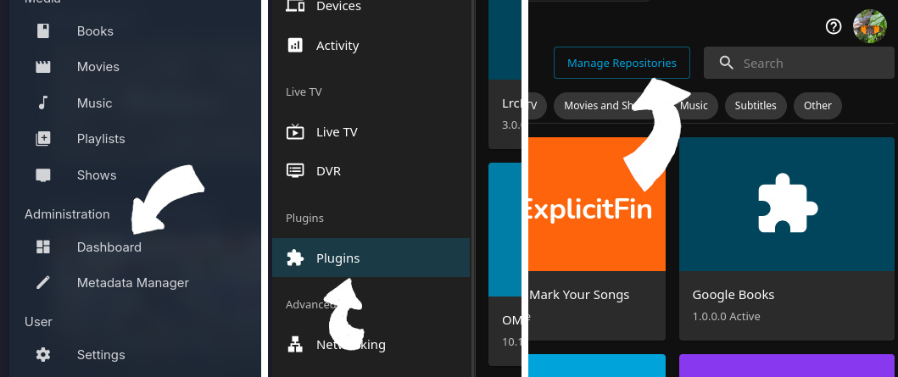

<div align="center">
<p align="center">
  
</p>

# ExplicitFin: Mark Your Songs

Don't you hate when your blasting your favorite song on your stereo just to remember "oh yeah, this song has a bunch of obscenities"...

Most media players do not have a standardized way to stream "explicit" tags (or atleast don't respect them).

This plugin detects if a song is considered "Explicit" against a database and appends a little `🅴` symbol at the end of a song's title.

It can also mark the <strong>album</strong> when Deezer lists it as explicit, or when enough tracks already have the symbol.

(Because no plugin is perfect), it even respects your manual edits.

<p align="center">
  
</p>

## Installing
<strong>Step 1</strong>
<p align="center">
  
</p>

<strong>Dashboard --> Plugins --> Manage Repositories</strong> --> <strong>+ New Repository</strong>:<br>
Name: <code>FinPlugins</code> (or whatever :P )<br>
URL: <code>https://raw.githubusercontent.com/TidBits16/FinPlugins/main/manifest.json</code><br>
<br>
(p.s. this bundle includes my other FinPlugins since they are designed to work together. <strong><em>they are not required to install!</em></strong>)<br>
For just <strong>ExplicitFin</strong> you can use this URL: <code>https://raw.githubusercontent.com/TidBits16/ExplicitFin/main/manifest.json</code>
<br>
<br>
<strong>Then Restart JellyFin!</strong>

<strong>Step 2</strong>
<p align="center">
  
</p>

<strong>Plugins</strong> --> <strong>All</strong> --> <strong>ExplicitFin: Mark Your Songs</strong> --> <strong>Install</strong><br>
<br>
<strong>Once Installed, Restart JellyFin Again!</strong></center>

## Build Locally

For development or packaging your own build:

```bash
dotnet build Jellyfin.Plugin.ExplicitTagger.csproj -c Release
./scripts/package.sh
```

The release zip will be in `dist/`.

Designed for <strong>Jellyfin 10.11+</strong> (you probably have this already :D)
<br>
Licensed under the <a href="LICENSE">GNU General Public License v3.0</a>
<p align="center">
  <a href="https://github.com/TidBits16/MusicFin"></a>
  &nbsp;
  <a href="https://github.com/TidBits16/ExplicitFin"></a>
  &nbsp;
  <a href="https://github.com/TidBits16/LyricFin"></a>
  &nbsp;
  <a href="https://github.com/TidBits16/ArtistFin"></a>
</p>
</div>
